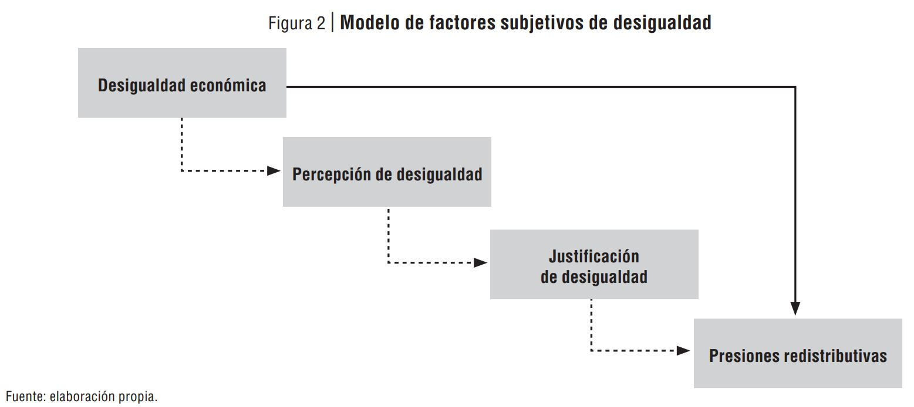
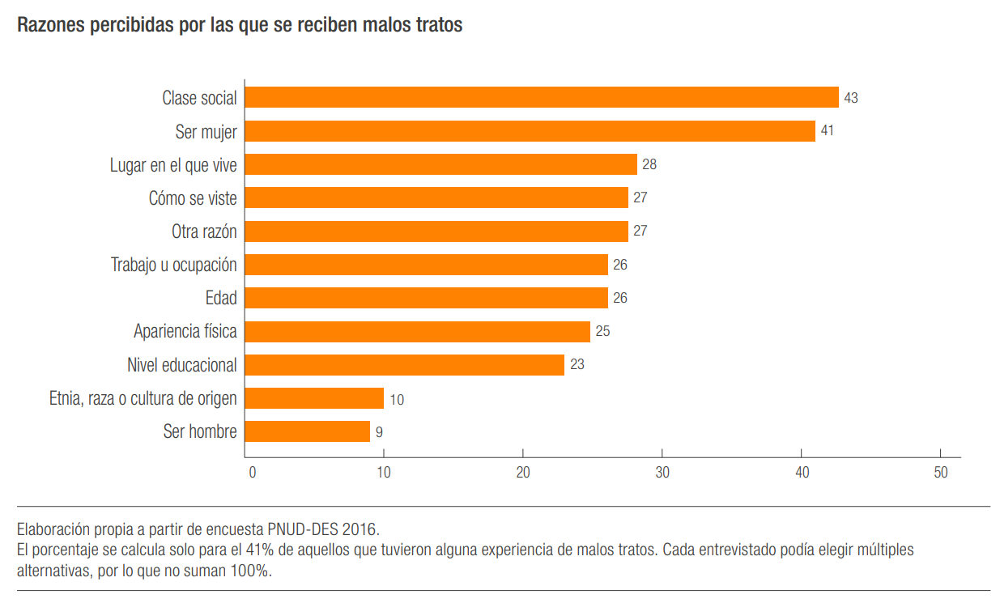
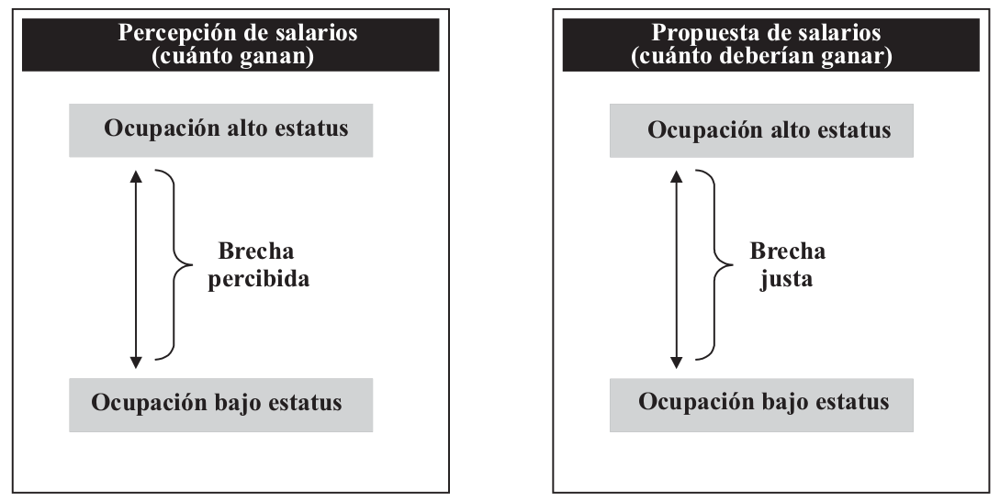

class: bottom, right, inverse

```{r eval=FALSE, include=FALSE}
# Correr esto para que funcione el infinite moonreader, el root folder debe ser static para si dirigir solo "bajndo" en directorios hacia el bib y otros

xaringan::inf_mr('/static/docpres/02_bases/2mlmbases.Rmd')
```

```{r setup, include=FALSE, cache = FALSE}
require("knitr")
options(htmltools.dir.version = FALSE)
# pacman::p_load(RefManageR)
# bib <- ReadBib("../../input/bib/My Library.bib", check = FALSE)
opts_chunk$set(warning=FALSE,
             message=FALSE,
             echo=TRUE,
             cache = TRUE,fig.width=7, fig.height=5.2)
```

<!---
Para correr en ATOM
- open terminal, abrir R (simplemente, R y enter)
- rmarkdown::render('static/docpres/07_interacciones/7interacciones.Rmd', 'xaringan::moon_reader')

About macros.js: permite escalar las imágenes como [scale 50%](path to image), hay si que grabar ese archivo js en el directorio.
--->

# ¿Menos desigualdad, más injusticia?
## Cambios en percepción y justificación de desigualdad salarial en Chile entre 1999-2019
UTOKIO - LAINAC Conference: _Rethinking Inequality_ - Enero, 2020

----
## Juan Carlos Castillo
(Francisco Meneses, Julio Iturra, Luis Maldonado, Jorge Atria)
<br>
<br>

### FONDECYT 1160921 - COES - Universidad de Chile


---

layout: true
class: animated, fadeIn

---
class: roja, middle, center

## CONTEXTO (1): 

# Chile

---
class: middle

## Desigualdad y gasto social


.small[
Maldonado, L., Castillo, J. C., Iturra, J. C., Atria, J., & Meneses, F. (2019, November 3). Meritocracia y redistribución en Chile: señales de la opinión pública. https://doi.org/10.17605/OSF.IO/G4EK8
]

---
## Estallido social Octubre 2018


---
class: roja, middle, center

## CONTEXTO (2): 

# Investigación

---
# Marco general agenda investigación



---
## Contexto de investigación actual

- Proyecto **La economía moral de la meritocracia y las preferencias redistributivas** - FONDECYT grant 1160921

--
  - Juan Castillo (UCH), Luis Maldonado (UC) & Jorge Atria (UDP)

  - 2016-2020

  - Estudios cualitativos (entrevistas y grupos focales)

  - Análisis de datos secundarios (ISSP)

  - Experimentos de encuestas

---
## Algunos resultados - artículos

.small[

- Maldonado,L., Olivos, F. Azar, A. Castillo, J. & Atria, J.(2019) Risk exposure, humanitarianism and willingness to pay for universal healthcare: A cross-national analysis of 28 countries. _Social Justice Research_

- Frei, R., Castillo, JC., Henríquez, R. & Suárez, J. (2018 - Forthcoming 2020) “¿Fruto del esfuerzo?”: los cambios en las atribuciones sobre pobreza y riqueza en Chile entre 1996 y 2015. _Latin American Research Review_.

- Castillo, JC. Olivos. F. & Azar, A. (2018) On the justice of pensions: A factorial survey approach (with Francisco Olivos & Ariel Azar). Accepted in Social Science Quarterly DOI: 10.1111/ssqu.12539.

- Castillo, JC. & Torres, A. , Atria, J & Maldonado, L. (2018) Meritocracia y desigualdad económica: Percepciones, preferencias e implicancias. Forthcoming in Revista Internacional de Sociología

- Castillo, JC & Rivera,M. (2018) Poverty and wealth attributions: A second order confirmatory factor analysis model. Forthcoming in Psykhe

- Azar, A., Maldonado, L., Castillo, JC & Atria, J. (2018) “Income, Egalitarianism, and Attitudes Towards Healthcare Policy: A Study on Public Attitudes in 29 Countries” Public Health 148:59-69

- Atria, J., Amenábar, J., Sanchez, J., Castillo, JC & Cociña, M. (2017) Investigando a la élite económica: Lecciones y desafíos a partir del caso de Chile. Cultura, Hombre y Sociedad 27(2)5-36 (Scielo)

---

## En elaboración

- García-Sánchez & Castillo, JC.- Taking from the rich or giving to the poor: The two faces of support for redistribution

- Franetovic & Castillo, JC - Redistributive preferences in unequal contexts: Changes in Latin America between 2008 and 2016

- Beck & Castillo, JC - About the stability of meritocratic beliefs: A longitudinal measurement invariance approach.
]

---
## Algunos resultados - tesis

.small[
- Plaza, A. (2018) Movilidad social y preferencias por la redistribución: Efectos individuales y contextuales. Magíster en Sociología, P. Universidad Católica de Chile.

- Franetovic, G. (2018) Desigualdad, desarrollo económico y preferencias redistributivas en América Latina. Magíster en Sociología, P. Universidad Católica de Chile.

- Muñoz, E. (2018) Evaluaciones de justicia distributiva sobre las pensiones de vejez en Chile. Magíster en Sociología, P. Universidad Católica de Chile.

- Sandoval, D. (2017) Merezco estar aquí: Un estudio multinivel sobre la relación entre meritocracia y educación. Magíster en Sociología, P. Universidad Católica de Chile.

- Montedónico, S. (2017) Contexto Polı́tico Institucional y Preferencias Redistributivas en América Latina. Magíster en Sociología, P. Universidad Católica de Chile.

- Beck, G. - Redes de contacto extensas y la justificación de la desigualdad social en Chile.

- Iturra, J. - Estatus Social Subjetivo y
percepción de meritocracia: el caso de Chile

- Rojas, S. La dimensión subjetiva de la desigualdad de género en ingresos: factores asociados a percepción de salarios y preferencias de justicia
]

---

## ... más información


- En el sitio web de nuestro proyecto en Researchgate: [https://www.researchgate.net/project/The-moral-economy-of-meritocracy-and-redistributive-preferences](https://www.researchgate.net/project/The-moral-economy-of-meritocracy-and-redistributive-preferences)

- en [jc-castillo.com](https://jc-castillo.com)


---
class: roja, middle, center

## Este trabajo:

# ¿Menos desigualdad, más injusticia?
### Cambios en percepción y justificación de desigualdad salarial en Chile entre 1999-2019
---
## Antencedentes
<br>
.center[

]

---
## Antecedentes


---
class: inverse, middle, center

# _¿Se percibe en Chile un cambio en los niveles de desigualdad?_

--

# _¿Ha disminuido la tolerancia/justificación de la desigualdad en Chile?_

---
## Desigualdad subjetiva


???

Ideas:
- perspectivas en el estudio de la desigualdad
  - Normativa: filosofía política, asociada al concepto de justicia
  - Descriptiva, típica de la sociología, movilidad social
  - Y la subjetiva

---
## Antecedentes

.pull-left[
### Desigualdad subjetiva
.small[
- Kluegel, J., & Smith, E. (1981). Beliefs About Stratification. Annual Review of Sociology, 7, 29–56.

- Kluegel, J., & Smith, E. (1986). Beliefs About Inequality: Americans’ Views of What Is and What Ought to Be. Aldine de Gruyter.

- Kluegel, J., Mason, D., & Wegener, B. (1995). Social Justice and Political Change: Public Opinion in Capitalist and Post-Communist States. Aldine de Gruyter.
]
]

.pull-right[


]

---
## Brechas salariales subjetivas




---
## Desigualdad y sesgos perceptuales

.center[

]
.small[Schroeder & Castillo (submitted)]

---
class: roja, center, middle

# Metodología


---
## Datos

- ISSP (International Social Survey Programme) 1999, 2009 y 2019 (CEP)

  - Muestra de aproximadamente 1,500 casos por ola
  - Representativa nacional
  - Cuestionario administrado como anexo a encuesta CEP 


---
## Variables

**Tabla 1**: Descriptivos generales 1999-2019

<object width="800" height="400" data="../../output/tables/desc.html"></object>

---
## Métodos

- análisis descriptivo

- modelos de regresión

---
class: roja, middle, center

## Resultados 1: 

# Análisis descriptivo

---
## Salario percibido


---
## Salario percibido y real obrero


---
## Salarios justos


---
## Brechas


---
## Brecha percibida y educación


---
## Brecha justa y educación


---
class: roja, middle, center

## Resultados 2: 

# Modelos

---
## Modelos

.medium[
**Tabla 5**: Modelos de regresión para brecha percibida y justa en 1999, 2009 y 2019]
<object width="800" height="400" data="../../output/tables/table_gapyear.html"></object>


---
class: inverse

# Discusión

- Subpercepción en relación a salarios reales

- Estratificación de la percepción

- Disminución de brechas salariales percibidas y justas en 2019

- Efecto constante y considerable entre lo percibido y lo justo

- ¿Consecuencias de la disminución de la brecha justa?


---
class: inverse center
<br>
<br>


# ¿Menos desigualdad, más injusticia?
## Cambios en percepción y justificación de desigualdad salarial en Chile entre 1999-2019
<br>

TOKIO - LAINAC Conference - Enero, 2020
<br>


Más información y detalles en:

[Repositorio Github](https://github.com/juancarloscastillo/chilegapstime)

[jc-castillo.com](https://juancarloscastillo.github.io/jc-castillo/)
