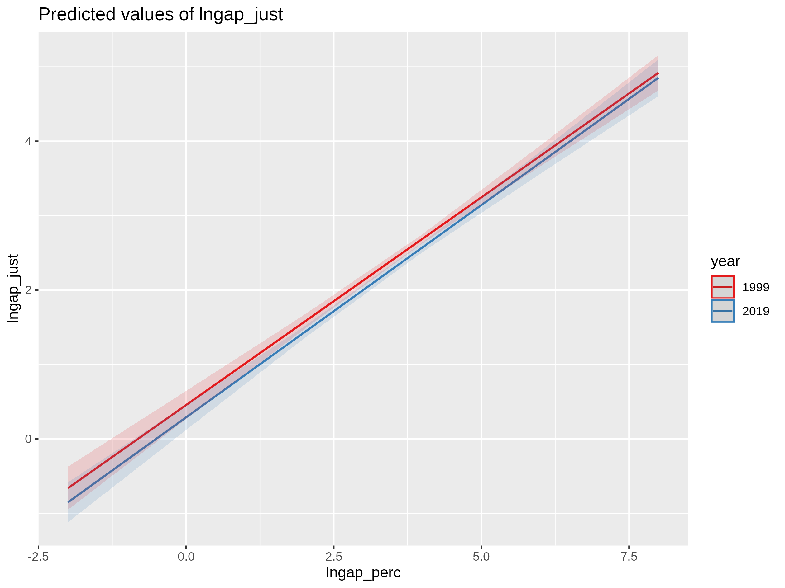

```{r include=FALSE}
knitr::opts_chunk$set(warning = FALSE,message = FALSE, cache = TRUE)
options(scipen=999)
rm(list=ls())
```

<div style="text-align: justify">

<h1> Cambios en la percepción y justificación de desigualdad salarial en Chile 1999-2009 </h1>

**Juan Carlos Castillo, Luis Maldonado, Julio Iturra & Francisco Meneses**


# Descriptivos

## Grafico 1: salario percibido del gerente y el obrero


- Si bien en el gráfico se destaca el crecimiento del salario del gerente igualmente crece la percepción del salario del obrero.
- Se mantiene durante todo el periodo una gran distancia entre ambos salarios
- El salario de los obreros está fijado en el salario mínimo siendo este la mediana. Punto de referencia, asociado a estatus bajo.
- Resulta interesante que la mitad de las personas creen que un obrero no calificado gana menos del mínimo.

## Grafico 2: Salarios justos y reales para gerentes y obreros. 


- Este gráfico debe leerse como el contraste entre las desigualdades existentes y las desigualdades que serían consideradas justas. Las barras verdes exponen los salarios justos para obreros y gerentes, mientras que las azules las diferencias reales. Las diferencias existentes exceden lo que las personas consideran justo. 
- El primer año el salario real coincide con el percibido para el obrero. Siendo igualmente menos de la mitad de lo que las personas consideran justo. De hecho en todo el periodo el salario  justo para una ocupación de bajo estatus es aproximadamente el doble de lo real y lo percibido.
- El salario justo para un gerente es creciente, mientras que el salario real crece a un ritmo mayor. Podríamos decir que la distancia entre el salario real de algunos gerentes y el salario considerado justo para ellos, es cada vez mayor, es decir, existe una injusticia por sobrepago creciente. 


## Grafico 3:  Comparacion de las brechas salariales obrero-gerente, percibida y  justa, entre 1999 y 2019


- Este grafico representa cuantas veces más es el sueldo del gerente en relacion al del obrero. La linea verde, nos dice, en el primer año, que las persobas perciben que el salario del gerente es equivalente al salario de 33 obreros. La linea azul, en el mismo año, nos dice que un gerente deberia ganar 10 veces lo que gana un obrero. Por su parte, la linea celeste señala que en concreto, los gerentes ganan 47 veces lo que un obrero. En este año, podemos decir que existe una gran distancia entre las brechas justas y las percibidas, y entre las percibidas y las reales. Dicho de otro modo, la gente percibe más diferencias de las que considera justas, pero menos de las que realmente existen. Esto se convierte en una situaicon latentemente positiva para el apoyo a las politicas redistributivas, pues si consideramos que ajustar las percepciones a las brechas reales puede ajustar las opciones redistributivas, podemos decir que exponer a las personas a las desigualdades reales, puede fomentar en ellos la aprobacion de estas politicas. 
- En terminos de la tendencia temporal, podemos decir que las brechas percibidas se alejan cada vez mas de las brechas reales entre obreros y gerentes dueños de grandes empresas. 

- por su parte la brecha considerada justa es cada vez mayor. 

- una pregunta interesante es por que las personas perciben menos igualdad salarial ¿como nos convencen de ello? 


## Grafico 3:  Comparacion de las brechas salariales percibidas segun nivel educativo.
 

- Este gráfico representa la brecha percibida según nivel educativo, como puede verse, el primer año existe una gran diferencia en las brechas percibidas entre personas con educación terciaria y quienes tienen media o menos. 
- Esta diferencia de percepción va disminuyendo en el tiempo, pues cada año parece existir menor diferencia entre las percepciones de personas de distinto nivel educativo. No obstante, aun los grupos con mas educacion perciben brechas mayores que los grupos sin educación superior. 

## Grafico 4:  Comparacion de las brechas salariales justificadas segun nivel educativo.


 

-  Este grafico nos expone las diferencias salariales consideradas justas difieren segun nivel educacional, siendo quienes tienen mayor educacion quienes justifican mayores diferencias. No obstante, tal como en el caso anterior, estas diferencias disminuyen con el pasar del tiempo, de tal modo que en el ultimo año las diferencias son practicamente nulas. 


## Grafico 4: Comparacion del apoyo a politicas redistributivas segun nivel educativo.


-  Este gráfico expone el porcentaje de personas que consideran que es deber del EStado disminuir las diferencias entre ricos y pobres. Si bien, puede observarse diferencias en el porcentaje de adhesión a dicha frase según nivel educativo en el primer año, esta diferencia pasa a ser marginal en los años siguientes, lo que nos da cuenta de que el apoyo a la redistribución pasa a ser un tema transversal  en la actualidad, y no solo un tema que interesa a quienes tienen menos oportunidades.


# Tablas de regresiones 

```{r echo=FALSE}
library(stargazer)
```

## Tablas de regresiones para brechas segun año.  

### 1999
```{r results='asis',echo=FALSE}
load("output/tables/reggap99.r")
stargazer(list(reggap99), type = "html")
```
- ...
- ...

### 2009
```{r results='asis',echo=FALSE}
load("output/tables/reggap09.r")
stargazer(list(reggap09), type = "html")
```

- ...
- ...

### 2019
```{r results='asis',echo=FALSE}
load("output/tables/reggap19.r")
stargazer(list(reggap19), type = "html")
```

- ...
- ...

## Evaluación del cambio de fuerza de la relacion entre Brechas percibidas y justas.





- No existe variacion en el tiempo de la relacion entre brecha percibida y brecha considerada justa


# **Regresion principal: explicando redistribucion por brechas salariales**


```{r results='asis',echo=FALSE}
load("output/tables/regredis.r")
stargazer(list(regredis), type = "html")
```
  -  Cada vez tiene un peso mayor la brecha de desigualdad percibida, mas que la brecha salarial considerada justa. 
  -  El efecto de las brechas resiste a los controles estadisticos de educacion e ingresos 
  - el efecto de las creencia meritocracia es positivo, es decir, quienes consideran el esfuerzo fundamental para salir adelante quieren redistribucion, lo cual es relativamente contradictorio en base a la teoria. Podria explicarse por que en chile las personas no sienten que dichos esfuerzos son pagados pese a que deberian serlo. ESte efecto desaparece al incorporar muchos controles, pero bien puede deberse a la disminucion del tamaño muestral y no al tamaño del efecto, el cual aumenta. 


