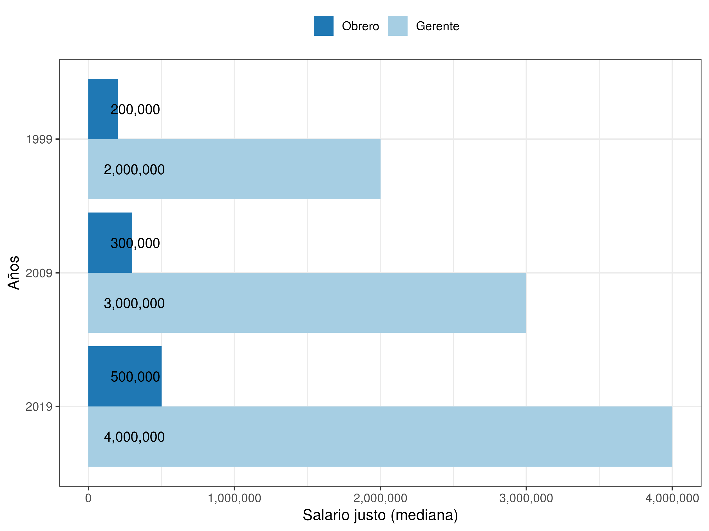
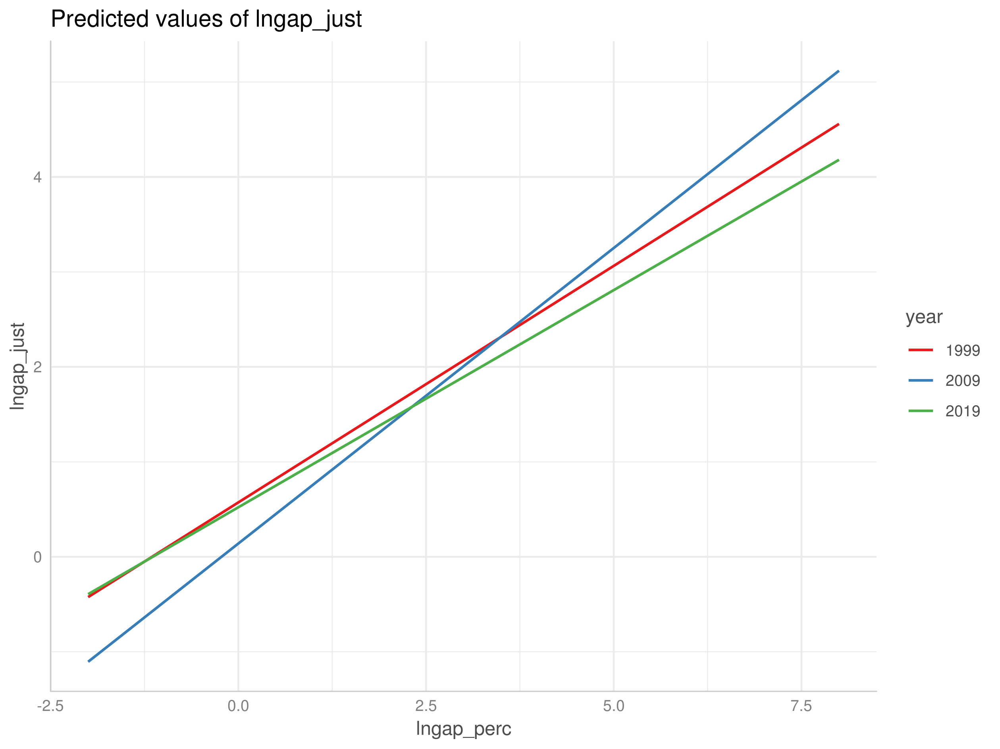

```{r include=FALSE}
knitr::opts_chunk$set(warning = FALSE,message = FALSE, cache = TRUE)
options(scipen=999)
rm(list=ls())
```

<div style="text-align: justify">

<h1> ¿Menos desigualdad, más injusticia?
<br> Cambios en percepción y justificación de desigualdad salarial en Chile entre 1999-2019 </h1>

**Juan Carlos Castillo** - juancastillov@uchile.cl, [jc-castillo.com](http://jc-castillo.com)
<br>**Francisco Meneses, Julio Iturra, Luis Maldonado & Jorge Atria**

# Introducción

La desigualdad económica es un tema que se ha tomado la agenda nacional e internacional en el último tiempo. Las amenazas que representa la desigualdad para la democracia [@bartels_Unequal_2010;  @schlozman_unheavenly_2012], la creciente desigualdad entre países [@milanovicGlobalInequalityNew2016], así como también la concentración de los ingresos en el 1% más rico (top incomes) representan un desafío a las ciencias sociales a la hora de dar cuenta de los orígenes y consecuencias de la desigualdad. Este desafío parece ser ahora más relevante que nunca en el contexto de estallido social Chileno desde Octubre de 2019, donde gran parte de las demandas se asocian directamente al concepto de desigualdad.

Las aproximaciones tradicionales de disciplinas como la economía han puesto el énfasis en la medición de la desigualdad objetiva vía ingresos, mientras la sociología se ha caracterizado por el estudio de clases ocupacionales y movilidad social. También desde la sociología han surgido perspectivas que enfatizan el rol de la subjetividad, relevando aspectos como la medida en que esta desigualdad es percibida y eventualmente rechazada (o justificada) por los individuos  [@castillo_inequality_2012; @mac-clure_Judgments_2015]. El foco en percepciones, justificaciones y preferencias respecto de desigualdad ha emergido con fuerza durante la última década [@mccall_undeserving_2013-1; @alesina_preferences_2011; @rueda_Who_2019], caracterizada por crisis sociales a nivel internacional que plantean claras demandas por la reducción de la desigualdad económica.

Volviendo al caso particular de Chile y sus reivindicaciones sociales actuales, es posible identificar visiones contrapuestas. Por un lado se señala que Chile a transitado un proceso de modernización exitoso y ejemplar en América Latina, aumentando significativamente su crecimiento económico y a la vez con una disminución de la desigualdad medida mediante el índice de Gini, tal como se ilustra a continuación:

**Figura 1**: Evolución de crecimiento económico (PIB) y desigualdad en países de América Latina

<iframe width="400" height="325" frameborder="0" scrolling="no" marginwidth="0" marginheight="0" src="https://www.google.com/publicdata/embed?ds=d5bncppjof8f9_&amp;ctype=l&amp;strail=false&amp;bcs=d&amp;nselm=h&amp;met_y=ny_gdp_pcap_kd&amp;scale_y=lin&amp;ind_y=false&amp;rdim=region&amp;idim=country:CHL:COL:PER:ARG:MEX&amp;ifdim=region&amp;tstart=126932400000&amp;tend=1483930800000&amp;hl=es&amp;dl=es&amp;ind=false"></iframe>

<iframe width="400" height="325" frameborder="0" scrolling="no" marginwidth="0" marginheight="0" src="https://www.google.com/publicdata/embed?ds=d5bncppjof8f9_&amp;ctype=l&amp;strail=false&amp;bcs=d&amp;nselm=h&amp;met_y=si_pov_gini&amp;scale_y=lin&amp;ind_y=false&amp;rdim=region&amp;idim=country:CHL:COL:PER:ARG:MEX&amp;ifdim=region&amp;tstart=631854000000&amp;tend=1452308400000&amp;hl=es&amp;dl=es&amp;ind=false"></iframe>

<br>

Por otro lado, se plantea que las cifras macroeconómicas no reflejan la realidad cotidiana del país, caracterizada por una privatización y precarización en ámbitos clave de la política social como salud, educación y pensiones, además de un contexto creciente de abusos, corrupción y desigualdad en el trato [@larranaga_Desiguales_2017]. Esto ha sido documentado en una serie de estudios, tal como el informe llamado Desiguales, del Programa de las Naciones Unidas para el Desarrollo:

**Figura 2**: Razones percibidas por las que se reciben malos tratos

{ width=80%}

Ante la paradoja de mejoras en aspectos objetivos acompañados de un fuerte malestar subjetivo, surge la pregunta sobre el vínculo entre la desigualdad económica y su justificación: _¿Se percibe en Chile un cambio en los niveles de desigualdad? ¿Ha disminuido la tolerancia/justificación de la desigualdad en Chile? ¿Cómo se relacionan los cambios en la justificación de desigualdad con preferencias por redistribución económica?_

El presente trabajo representa la proyección de una línea de investigación sobre percepción y justificación de desigualdad en Chile iniciada el año 2009 [@castillo_cual_2009; @castillo_inequality_2012]. Parte de estos estudios han analizado dimensiones subjetivas de la desigualdad entre 1999 y 2009, y en este documento se prentende avanzar agregando una década más al análisis gracias a la reciente disponibilidad de los datos para Chile del estudio ISSP 2019 (International Social Survey Programme - www.issp.org).

El trabajo comienza dando un contexto de los estudios sobre aspectos subjetivos de la desigualdad. Luego se presentan inicialmente descriptivos sobre percepción y justificación de desigualdad salarial entre 1999 y 2019, para luego finalizar con algunos modelos que permiten contrastar hipótesis sobre la relación entre percepción y justificación de desigualdad en el tiempo.

El documento se estructura de la siguiente manera: en primer lugar se entregarán ciertos antecedentes conceptuales y empíricos para el estudio de percepción y justificación de desigualdad, para luego mostrar resultados comparativos en el tiempo. En la segunda parte se le dará énfasis a las relaciones de estatus objetivo y subjetivo con la percepción de desigualdad y también a los cambios de estas relaciones en el tiempo.

# Percepción y justificación de desigualdad

Los estudios de desigualdad y justicia social han sido nutridos desde múltiples perspectivas disciplinares. Desde la filosofía política se han dado amplios debates respecto a cuál es la manera normativamente correcta de distribuir los recursos [@dworkin_sovereign_2000; @sen_inequality_1992-1]. En este marco, @rawls_theory_1971 señala que los estudios sobre la justicia social deben considerar en su análisis las creencias concretas que poseen los sujetos, no para quedarse ciegamente con ellas, sino para generar un “equilibrio reflexivo”. Desde esta línea teórica del estudio de la desigualdad se desprende la importancia de conocer los criterios de justicia existentes en la población.

Desde la sociología se ha dado tradicionalmente un acento empírico al estudio de la desigualdad. Esta disciplina no solo tempranamente abordó el estudio de la distribución objetiva de los recursos en una población, sino que también pueden observarse reflexiones en torno al modo en cómo los sujetos perciben y  justifican la desigualdad existente [@kluegel_beliefs_1986; @kluegel_social_1995-1; @huber_Income_1973; @mason_Marketing_2000; @mau_Ungleichheitsund_1997; @stollte_Legitimation_1983]. De manera más reciente, se han incorporado a este tipo de estudios el concepto de actitudes y percepciones hacia la desigualdad económica, relacionando dichos conceptos con la justificación de la desigualdad [@ardanaz_preferences_2009; @evans_justifications_2010; @gijsberts_legitimation_1999-1; @hadler_why_2005; @janmaat_subjective_2013-1; @kenworthy_inequality_2007; @kuhn_subjective_2005; @liebig_justice_2013] .

El estudio de la desigualdad en términos subjetivos se puede abordar desde distintas perspectivas y metodologías. Una línea que posee un claro énfasis comparativo es la que se establece mediante el International Social Justice Project, que realiza la primera encuesta comparativa internacional en temas de justicia y desigualdad en países capitalistas y postcomunistas en el año 1991 [@kluegel_social_1995-1]. Desde ese entonces un desafío en este tipo de investigación tiene que ver con la manera de abordar el tema de desigualdad. Uno de estos desafíos se refiere a qué preguntar respecto de la desigualdad, ya que en general la mayor parte de la población actualmente tiende  declarar una alta desigualdad, generando escasa variabilidad y por lo tanto haciendo difícil capturar diferencias entre personas y en el tiempo  [@castillo_percepcion_2012]. Al respecto, una posible alternativa para analizar tanto percepción como justificación de desigualdad mediante encuestas consiste en medidas indirectas de desigualdad salarial subjetiva, conocidas como brechas salariales percibidas y justas [@castillo_cual_2009]:

**Figura 3**: Diagrama de brechas salariales [@castillo_inequality_2012]

{ width=70% }

Para poder operacionalizar estas brechas, se utilizan preguntas respecto de salarios percibidos y justos en relación a ocupaciones que expresan los extremos del continuo de estatus, como obrero y gerente. Las respuestas son registradas como una magnitud en pesos, y luego con estas respuestas es posible elaborar las brechas percibidas y justas, dividiendo el monto otorgado al gerente por el monto del obrero. Esta magnitud expresa cuánto más se percibe o justifica que un gerente gana respecto de un obrero.

La evidencia anterior comparando datos de Chile para 1999 y 2009 indica que si bien existen cambios en los montos absolutos de salarios percibidos y justos, las brechas tanto percibidas como justas se mantienen en el tiempo. Además, tomando como base estudios que vinculan variables de estatus con percepción de desigualdad [@castillo_percepcion_2012; @wegener_equity_1990], se plantea que aquellos en el extremo superior de estatus poseen información más precisa de salarios de ocupaciones de mayor prestigio, y por lo tanto su brecha salarial percibida será mayor.

<!-- [argumento percepción-justificación]
-->
<!--
## Desigualdad subjetiva y redistribución

Las preferencias por la redistribución constituyen un ámbito de investigación que concentra creciente atención. Dada la crisis del capitalismo global y la creciente concentración de ingresos, la opinión de las y los ciudadanos respecto de cómo se deberían redistribuir los recursos desde quienes poseen más hacia quienes poseen menos se vuelve central [@alesina_preferences_2011; @alt_inequality_2017; @rueda_Who_2019]. Las preferencias aparecen como un termométro social que indica la temperatura de la sociedad respecto de la temática de la desigualdad y la demanda ciudadana por bienestar (Soroka & Wlezien, 2009). Junto a ello, la opinión pública también juega el rol de un actor que puede tanto promover como bloquear cambios a las reglas del juego en una sociedad (Jensen & Naumann, 2016; Pierson, 1996)

En general las teorías respecto a los determinantes de las preferencias consideran dos vertientes: el interés racional y el altruismo. La hipótesis de interes racional basada en un modelo de _homo-economicus_ señala que las preferencias por la redistribución tienen que ver con un cálculo personal de beneficios y riesgos, por lo tanto quienes se beneficien menos de políticas redistributivas (aquellos de mayor estatus) tenderán a manifestar un mejor apoyo a la redistribución. Por otro lado, la versión altruista o de _homo-sociologicus_ señala que valores de recirpocidad e igualitarismo son centrales, llevando a un apoyo transversal por la redistribución [@Dimick2018ModelsOtherRegardingPreferences]. Si bien no contamos con antecedentes respecto de la relación entre brechas salariales subjetivas y preferencias redistributivas, es posible plantear que una alta desigualdad percibida llevará a un mayor apoyo hacia la redistribución.
-->


# Datos, variables y métodos

El ISSP es un proyecto de colaboración internacional sobre encuestas que cubre un amplia gama de temas relevantes para las ciencias sociales. Comenzó en 1983 en cuatro paises (Alemania, Estados Unidos, Gran Bretaña y Australia), y hasta ahora se ha ampliado para incluir más de 40 países. Dado su carácter colaborativo, cada país miembro debe contribuir con fondos para implementar la encuesta, y generalmente el El cuestionario ISSP se administra como parte de las encuestas nacionales existentes. En el caso chileno, las encuestas son gestionadas por el Centro de Estudios Publicos (CEP).  
Cada año, la encuesta cubre un tema en particular que se repite unos años más tarde, permitiendo comparaciones de tiempo. Los temas son decididos por un subcomité formado por representantes de los paises participantes. Luego se escribe un cuestionario general en inglés para ser traducido más tarde en los idiomas específicos de cada contexto. Una vez que la información es recopilada y proporcionada por cada país, los datos se archivan en Gesis en Alemania, con soporte en el procesamiento de los datos de la ASEP (Análisis Sociológico Ógicos Económicos y Políticos) en Madrid.
La desigualdad social fue el tema de investigación para los módulos del ISSP 1987, 1992, 1999, 2009 y 2019. Esta encuesta incluye una serie de ítems de actitud con respecto al ingreso distribución, percepción de desigualdad, principios distributivos y expectativas sobre El papel del estado con respecto a la desigualdad social, así como las preguntas sobre la percepción y evaluación del ingreso ocupacional. La implementacion de este programa en Chile comienza en 1998,  y hasta la fecha, se cuenta con tres olas de la encuesta sobre desigualdad social. La encuesta del 2019, aun no ha sido fusionada con las encuestas de los otros paises, por lo que solo contamos con la base de datos construida por el CEP dispoblibe en su pagina oficial (www.cepchile.cl). 	Las encuestas de 1999, 2009 y 2019 son representativas a nivel nacional, se realizan cara a cara e incorporan 1503, 1505 y 1380 casos, respectivamente. 
La principal variable dependiente del estudio es la justificación de la desigualdad económica, operacionalizada a través de la brecha salarial justa. El ISSP incluye preguntas en las que se solicita a los encuestados que declaren los salarios que consideran justos para ocupaciones de bajo y alto estatus. Como se explico anteriormente, la brecha justa es la razon entre el salario considerado justo para el gerente y el salario considerado justo para el obrero no calificado. Dicha variable, debe ser leida como cuantas veces más se considera justo que gane un gerente respecto a un obrero. Por ejemplo, si dicha brecha es igual a 2, se considera justo que el gerente gane el doble que el obrero. El mismo prosedimiento se utilizo para la variable independiente brecha percibida, la cual corresponde a cuantas veces más creen los encuestados que gana un gerente respecto a un obrero. Ademas, para incluir estas dos variables en los modelos de regresion, fueron normalizadas a partir de un logaritmo. 

Como variables de control para las regresiones se incluyen los ingresos (operacionalizados como los quintiles de ingresos percapita del hogar) y la educacion (considerando los niveles: primaria, secundaria, tercearia no univercitaria y univercitaria). A continuacion, en la tabla 1, se presentan descriptivos para todas las variables mensionasdas. 

<!-- Hay dos tablas, la segunda es con stargazer y la primera con psych, desida usted con cual quedarnos. 
-->
**Tabla 1**: Descriptivos generales 1999-2019

<object width="800" height="800" data="output/tables/desc.html"></object>

<object width="800" height="800" data="output/tables/desc_2.html"></object>


# Resultados

## Desigualdad percibida

En primer lugar se exponen las percepciones y justificaciones respecto a las diferencias salariales entre obreros y gerentes. Para ello utilizaremos la mediana reportada por los entrevistados, la cual es un mejor indicador de tendencia central de montos en pesos al no estar afectado por posibles valores altos en los extremos.

{#fig:brechper}

Lo primero que destaca del Gráfico 1 son los cambios en la percepción de salarios tanto para obreros como para gerentes, con un claro aumento en el tiempo. A primera vista lo más evidente es el aumento en la percepción del salario del gerente: el salario percibido del obrero solo aumento $210.000 entre estos años, mientras que el del gerente alcanza un incremento de $5.000.000. entre 1999 y 2019. No obstante, es relevante notar que el salario percibido del obrero creció más que el del gerente en términos proporcionales entre 1999 y 2009, puesto que mientras el primero aumenta más de tres veces, el segundo no alcanza a superar las 3 veces de aumento (incremento de 2,7).

Ahora bien, ¿qué tanto calza la percepción de desigualdad con la mediana real de salarios para cada año? Para ello, utilizaremos datos oficiales de la encuesta de caracterización socioeconómica CASEN para los años respectivos (XX nota al pie con el detalle de los análisis). Los resultados se muestran en el gráfico siguiente:

- Fco: gráfico de comparación percibido-real agrupados por ocupación/año; es decir: obrero/años/real y percibido, lo mismo para gerente.

Resulta interesante que la mediana del salario el obrero se aproxima bastante al monto del salario real del año respectivo. Esto nos lleva a deducir dos cosas: primero, las personas son conscientes en general de los montos de salario mínimo y, segundo, que asocian el salario de un obrero al salario mínimo. En cuanto al salario percibido para el gerente, vemos que es en general subestimado en todos los años y además con un creciente aumento en este sesgo perceptual. Es relevante considerar además que el salario percibido del gerente posee una mayor varianza que el del obrero, lo que indica que hay un menor consenso en la población respecto a cuánto ganan las personas en estas ocupaciones. Esto puede deberse a los distintos tipos de gerente que se están imaginando las personas al responder. Por ejemplo, según el estudio de la empresa internacional @roberthalf_Guia_2019 (encargada de reclutar de gerentes para el área de finanzas) en Chile el salario de un director de finanzas de una PYME o mediana empresa varía entre $5.000.000 y $9.500.000, mientras que el gerente de una gran empresa (sobre UF 100.000) gana entre $6.800.000 y $15.500.000 en promedio. Esto nos demuestra que existe gran diferencia entre un alto cargo de una empresa pequeña en relación con los altos cargos de una gran empresa.

En suma, tenemos que ha aumentado la percepción de dalarios de ocupaciones de bajo y alto estatus. Estos salarios percibidos no escapan radicalmente de la realidad, ya que coinciden con el salario mínimo establecido para Chile en el año respectivo así como también con la información disponible respecto a el salario que ganan los gerentes, pero sin embargo en el caso de los gerentes se aprecia una mayor variabilidad.

## Salarios justos

Pasando de la percepción de salarios al análisis de salarios considerados justos, el siguiente gráfico nos muestra las medianas de los salarios justos para obrero y gerente en los tres puntos en el tiempo analizados:



Como puede verse en el Gráfico 2, en los salarios considerados justos existe una notoria diferencia entre obreros y gerentes en todos los años. Esto nos sugiere que la completa igualdad salarial no es considerada justa por el grueso de la población, sino más bien existe un cierto nivel de desigualdad salarial que alcanza a ser tolerado o justificado, lo que analizaremos más adelante al momento de considerar las brechas percibidas y justas. No obstante, tomando en consideración el análisis anterior de salarios percibidos, se observa que los salarios considerados justos para los obreros son siempre mayores que los salarios percibidos para los mismos, así como el salario justo para el gerente es menor que el percibido. Por lo tanto, si bien la igualdad absoluta no es considerada justa, ciertamente se evidencia una tendencia hacia la disminución de las diferencias salariales como criterio de justicia en todos los años analizados.

Si tomamos como referencia el último año (2019), podemos decir que el salario considerado justo para un obrero es de $500.000 en promedio. Este valor, a diferencia del salario mínimo, se encuentra sobre la línea de la pobreza para una familia de 4 personas, la cual equivale en ese año a $440.000 [XX cita]. Con esto no queremos decir que las personas son conscientes de la línea de la pobreza establecida periódicamente por el ministerio de desarrollo social [XX cita  ], sino que las personas parecen poseer una idea general de cuanto es un mínimo necesario para vivir (o sobrevivir) en Chile tal como se establece de manera oficial.

Respecto al salario considerado justo para los gerentes, podemos ver que en general corresponde a la mitad de lo percibido para la misma ocupación. Es decir, el general de las personas cree que lo que ganan los gerentes en el país esta por sobre lo que deberían ganar, recibiendo el doble de lo justo. En suma, podemos decir en términos absolutos que la población chilena considera que la desigualdad salarial actual se encuentra lejos de lo justificado: mientras que el obrero gana prácticamente la mitad de lo que debería, los gerentes ganan el doble. Sin duda la exposición a situaciones de injusticia tiene consecuencias y es un potencial para la acción social que lleve a restaurar un equilibrio considerado justo [@homans_social_1961].

## Desigualdad relativa: Brechas percibidas y justas

Para analizar la distribución de los recursos de manera relativa evaluaremos la asociación entre las brechas salariales percibidas y justas. Para ello se divide en cada caso el salario del gerente por el salario del obrero, y por lo tanto se obtiene una magnitud que indica cuántas veces mas se percibe que gana un gerente en relación a un obrero (brecha percibida), así como también cuántas veces debería ganar un gerente más que un obrero (brecha justa). Como contexto, agregamos también la brecha salarial real calculada en base a la encuesta CASEN de los años respectivos.


Como muestra el gráfico 3, durante todo el período analizado la brecha considerada justa es menor a la brecha percibida, es decir, si bien la justicia no es igualdad absoluta, sí se mueve en la dirección de la igualdad o disminución de las diferencias actuales. Además, observamos que ambas brechas han disminuido. Si bien en 1999 las personas consideran que el gerente gana 33,3 veces más que el obrero, en 2019 la percepción de dicha brecha desciende a 22. Si recordamos que el salario tanto del obrero como el del gerente crecieron, podemos decir que la disminución de la brecha salarial percibida no se debe a la disminución de salarios de gerentes, sino a que el salario del obrero creció más (proporcionalmente) en estos 20 años que el salario del gerente. Ahora, si bien ha disminuido la brecha percibida, esta es todavía tres veces la brecha considerada justa.  Esto nos indica que las desigualdades en Chile exceden en gran medida lo que las personas están dispuestas a tolerar, y que esto ha ido en aumento en el tiempo a pesar de una disminución en la percepción de brechas salariales.

Por su parte, las brechas consideradas justas también han disminuido. Mientras en 1999 las personas consideraban justo que un gerente pudiera ganar 10 veces lo que un obrero, hoy solo consideran justo que gane 7,5 veces más. En suma, en términos absolutos, podemos decir que, si bien se ha percibido un aumento de los salarios, las personas consideran injustos los sueldos tanto de los gerentes como de los obreros, los primeros por sobrevaloración y los segundos por subvaloración. Cuando se analizan las brechas queda en evidencia que en promedio la percepción de desigualdad está muy lejos de las desigualdades salariales reales, que son mucho mayores, por lo tanto hay en general una subestimación de la desigualdad salarial. Junto a ello, otro elemento llamativo es que si bien las brechas reales aumentan en el tiempo, la desigualdad percibida disminuye de una manera muy marcada el año 2019, asociado a la percepción de aumento de los salarios de ocupaciones de bajo estatus.


## Percepción, Justificación y educación

Hasta ahora hemos visto análisis de promedios generales de la población y su cambio en el tiempo. En esta sección analizaremos diferencias en percepción y justificación de desigualdad en relación a variables de estatus, para lo cual utilizaremos en primer lugar la variable de educación. Los niveles educacionales considerados se presentan en el siguiente gráfico en relación a la brecha percibida:


Tal como nos muestra el gráfico 4, la brecha salarial percibida varía notoriamente entre grupos educacionales.  Destaca del gráfico que aquellos que cuentan con educación superior perciben durante todo el periodo mayores niveles de desigualdad salarial. Esto podría explicarse por sus contextos de trabajo que implican una posición intermedia o superior que les permite tener información más precisa respecto a sueldos de altos cargos [@castillo_percepcion_2012]. Durante el periodo, las diferencias perceptuales de brechas entre distintos niveles educacionales van disminuyendo, tanto en términos absolutos como relativos. Además, resulta interesante que quienes tienen nivel educacional básico o menos subestiman las desigualdades, no solo en relación con los otros grupos sino también comparando con la realidad. Según la OCDE, el 10% más rico en Chile gana 26 veces más que el 10% más pobre (**XX cita**), y suponiendo una coherencia aproximada entre estos grupos y la diada gerente obrero, podemos decir que quienes tienen menos educación subperciben la brecha real.


Analizando ahora las brechas consideradas justas, se aprecia que los valores son muy distintos a las brechas percibidas. En 1999 el grupo que percibe mayores brechas considera que el gerente gana 50 veces más que el obrero, mientras considera justo que gane solo 15 veces más. El 2019 el grupo que mayor brecha percibe cree que el gerente gana 29 veces más que el obrero, mientras que considera justo solo que gane 10 veces más.  Si bien, ha disminuido la diferencia entre lo justo y lo que se percibe, aun las brechas percibidas son 3 veces más que las consideradas justas.  Podría pensarse que los grupos universitarios, en base a su esfuerzo educativo y a la mayor posibilidad de acceder a esos puestos, podrían estar más de acuerdo con las diferencias existentes, no obstante, este grupo privilegiado en la sociedad considera que las diferencias salariales son mucho mayores de lo que deberían.

Dado que los grupos de menor estatus son los que perciben menor desigualdad, es posible pensar que que exponer a estos grupos a información objetiva sobre las diferencias salariales (que son mucho mayores a lo que ellos perciben), podría llevarlos a hacer una reevaluación de la justicia salarial, llevándolos a encontrarla aun más injusta. Si consideramos además que en la actualidad la información es mucho mas fluida, podemos pensar que la exposición a indicadores de desigualdad puede transformarse en una presión en contra de la desigualdad.

## Modelos

En esta última parte del análisis se presentan una serie de modelos de regresión tanto de la brecha percibida como de la brecha justa, así como sus variaciones en el tiempo. Se presenta una tabla de modelos para cada año, y luego una tabla final donde se introduce el tiempo como una covariable.

La Tabla 2 presenta los resultados de los modelos para la brecha percibida y justa, los que incluyen educación e ingreso como variables independientes. En el caso del Modelo 1 para la brecha percibida, vemos que para el primer bloque de variables de educación (que tienen la categoría Básica Completa como referencia) todas muestran diferencias significativas, es decir, mayor percepción de desigualdad en mayores niveles de educación. Lo mismo se observa en relación a quintiles de ingreso, con un aumento lineal más claro. Por lo tanto, el año 1999 se aprecia de manera bastante clara la asociación estatus-percepción de desigualdad. En el caso de la brecha justa esto sucede solo con ingreso (controlado por educación), lo cual va en línea con una hipótesis de corte racional: a mayores ingresos, mayor justificación de la desigualdad. Sin embargo, vemos que estos efectos se anulan al momento de incorporar la percepción de desigualdad en el Modelo 3. Esto sugiere que si bien existen diferencias de estatus en percepción y justificación de desigualdad, cuando se considera la desigualdad percibida el estatus no genera diferencias en la percepción de la desigualdad. Dicho de otra manera, la diferencia entre percepción y justificación es similar para los distintos grupos de estatus, lo cual va en línea con una hipótesis de consenso entre distintos grupos de estatus respecto a la justificación de la desigualdad.

**Tabla 2**: Modelos de regresión para brecha percibida y justa - Año 1999

<object width="800" height="750" data="output/tables/table99.html"></object>

Respecto del año 2009, vemos en la tabla X una tendencia similar para brecha percibida tanto en ingresos como educación, si bien menos marcada que en 1999. También comparando con la ola anterior las diferencias aparecen más claras en la brecha justa, donde educación (principalmente a nivel universitario) aparece con un efecto significativo, además del de ingreso. En cuanto al modelo 3 con la brecha percibida como covariable se observa que el coeficiente asociado a la pertenencia al mayor quintil de ingresos ahora es significativo. Por lo tanto, aquellos pertencientes a este grupo justifican mayor desigualdad independiente de la desigualdad percibida.

**Tabla 3**: Modelos de regresión para brecha percibida y justa - Año 2009

<object width="800" height="750" data="output/tables/table09.html"></object>

En la tabla final de esta secuencia, correspondiente al año 2019, vemos que en la brecha percibida hay solo evidencia de la influencia de la educación en la brecha percibida, mientras en la brecha justa ya no existen diferencias entre los grupos de estatus. Recordemos que la disminución de las diferencias entre grupos de estatus ya era posible de observar en los gráficos sobre educación y brechas, donde hacia el 2019 se presenta una clara tendencia al consenso entre grupos educacionales tanto respecto de la brecha percibida como de la brecha justa.

**Tabla 4**: Modelos de regresión para brecha percibida y justa - Año 2019

<object width="800" height="750" data="output/tables/table19.html"></object>

Finalmente, la tabla X presenta los modelos para todos los años, incluyendo el año como una covariable que toma como referencia la primera ola de 1999. Dos aspectos a destacar de esta tabla son a) que las variables de estatus se asocian de manera positiva con la brecha percibida y también con brecha justa, aunque con menor intensidad en el caso de la última, y b) que el año 2019 es el que presenta una diferencia respecto de los dos anteriores en la disminución tanto de la brecha justa como de la brecha percibida.

**Tabla 5**: Modelos de regresión para brecha percibida y justa en 1999, 2009 y 2019.

<object width="800" height="800" data="output/tables/table_gapyear.html"></object>

**Tabla 6**: Modelos de regresión para brecha percibida y justa en 1999, 2009 y 2019, con interaccion

<object width="800" height="800" data="output/tables/table_gapyear_int.html"></object>



# A modo de conclusión

A pesar de una serie de limitaciones metodológicas, la investigación de aspectos subjetivos de la desigualdad económica mendiante encuestas aportan una serie de elementos que pueden contribuir al debate actual sobre desigualdad, especialmente en un momento de crisis social. En primer lugar destaca que los salarios considerados justos son bastante más igualitarios que los percibidos, aún cuando la brecha justa de salarios entre ocupaciones de distinto estatus no tiene como criterio a la igualdad absoluta. En segundo lugar, y de manera algo contraintuitiva, la brecha salarial percibida ha disminuido en el tiempo, pero a la vez esto ha ido acompañando por una menor justificación de las desigualdades salariales. Lo que se consideraba justo hace 20 o 10 años en Chile ya no lo es hoy, observando grandes cambios particularmente en la última década. En tercer lugar vemos que la percepción y justificación de salarios se siguen asociando a variables de estatus, tanto objetivo como subjetivo. Lo más relevante de esta asociación es que consistentemente los mayores niveles educacionales perciben y justifican más desigualdad salarial.

Pensando en una agenda a futuro, se requieren más investigaciones que conecten aspectos subjetivos de la desigualdad con agencia social: ¿son las percepciones y/o justificaciones de la desigualdad un mecanismo que puede explicar la acción política? Además, un ámbito interesante a profundizar, en especial con la brecha salarial justa, son las preferencias redistributivas: ¿en qué medida aquellos que prefieren menor desigualdad salarial también apoyan un mayor rol redistributivo desde el estado? Esta y otras preguntas serán posibles de abordar en futuros análisis, los que además pueden incorporar un componente comparativo temporal e internacional dada la riqueza de los datos disponibles actualmente para estudios sociológicos.

# Referencias

<div/>
